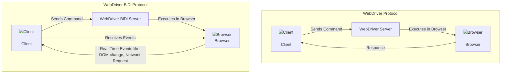

# WebdriverIO v9 - Browser Automation's Future

## Speaker: Christian Bromann, Senior Software Engineer, OutSystems
====================================================================

# Project State of WebdriverIO
## _A Journey from a small hobby project to one of the leading JavaScript frameworks for testing._
- **2012** First release from original maintainer Camilo Tapia as **WebdriverJS** as one of the first JavaScript libraries to automate browser
- **2014** Project re-naming / re-organisation into **WebdriverIO**
- **2017** Project joins the **JS Foundation** and sets up an open governance model
- **2018** First adopter of the **WebDriver protocol**
- **2019** **JS Foundation** merges into the **OpenJS Foundation**
- **2021** Project rewrite into **TypeScript**
- **2022** Migration from **CommonJS** to **ESM**
- **2024** Establishment of the **Contributor Stipend Program**
- **Today (2024)** v9 release with native **WebDriver BiDi support**

## _An Open Source project in numbers:_
- **1.5M** Weekly downloads on NPM
- **8.9k** Stars on GitHub
- **~4.6k** Monthly funding in USD
- **2.8k** Unique Daily Website Visitors
- **2k** Discord Members
- **591** Unique Total Contributors
- **68** Project Members
- **45+** Testrunner Plugins


## _Our deepest gratitude to our project sponsors._
## 👑 Premium Sponsors
- **SauceLabs** <a href="https://saucelabs.com/"></a>
- **BrowserStack** <a href="https://www.browserstack.com/"></a>

## 🥇 Gold Sponsors
- **Route4Me** <a href="https://www.route4me.com/"></a>

## 🥈 Silver Sponsors
- **LambdaTest** <a href="https://www.lambdatest.com/"></a>
- **TestingBot** <a href="https://testingbot.com/"></a>

## 🥉 Bronze Sponsors
- **ESLint** <a href="https://eslint.org/"></a>


## _WebdriverIO is a community-driven project and not owned/backed by a single corporation!_ 

- **We pay 🐝 to every contributor!**  
  Every pull request to the WebdriverIO project (either core or community project) is recognized with a financial return.

- **We have paid out more than $1.5k since start of the program**  
  To 25 individual contributors across 4 different projects.

- **Earn up to $80/hr**  
  as Steering Committee member or up to **$50/hr** as project member.

- **We pay out to all contributions**  
  no matter if it is code, video tutorials, help on the website, or design.


# WebDriver BiDi
With the release of WebDriverIO v9, native support for WebDriver BiDi was introduced, making it one of the first JavaScript frameworks to fully support the BiDi protocol. This brings a range of improvements and new capabilities to the WebDriverIO framework.


- **WebDriver Protocol**:
  - The communication is unidirectional, where the client sends commands to the WebDriver server, the server executes them in the browser, and the response is sent back to the client.
  
- **WebDriver BiDi Protocol**:
  - The communication is bidirectional. The client sends commands to the WebDriver BiDi server, which executes them in the browser, while the client can also receive real-time events (e.g., DOM changes, network requests) from the browser. 

# Testing web components with WebdriverIO v9
## Shadow DOM support


## Snapshots support


## New `url` Command Options
_More than just navigating to an application!_
- **Simple command in v8 and before**: This is the basic form of the `url` command that navigates to the given URL.
- **Include headers in the request**: The `url` command now allows adding custom headers like `Cookie` or `Authorization` to the request.
- **Overcome basic authentication**: You can now pass user credentials (`username` and `password`) directly to handle basic authentication.
### Example 1: Simple Command in v8 and Before
```javascript
await browser.url('https://webdriver.io')
```
This is the traditional way of navigating to a URL using the WebDriverIO url command.
### Example 2: Include Headers in the Request
```javascript
await browser.url('https://webdriver.io', {
    headers: {
        'Cookie': 'mysession=123456789'
    }
})
```
You can include headers like Cookie or Authorization in the request using the headers option in the new url command.
### Example 3: Overcome Basic Authentication
```javascript
await browser.url('https://webdriver.io', {
    auth: {
        username: 'admin',
        password: 'admin'
    }
})
```
This example demonstrates how to pass user credentials (username and password) in the auth object to overcome basic authentication challenges.
### Example 4: Execute JavaScript Before the Page Loads
In **WebDriverIO v9**, you can now execute custom JavaScript code before the application starts loading by using the `onBeforeLoad` option.
```javascript
await browser.url('https://webdriver.io', {
    onBeforeLoad: () => {
        // Custom JavaScript code to be executed before the page loads
    }
})
```
### Example 5: Execute JavaScript Before the Page Loads
In **WebDriverIO v9**, you can execute JavaScript before the page loads. This can be useful for emulating certain Web APIs that your application may use or for overwriting built-in class prototypes.
```javascript
await browser.url('https://pazguille.github.io/demo-battery-api/', {
    onBeforeLoad: (win) => {
        // Mock the navigator.battery property
        win.navigator.getBattery = () => Promise.resolve({
            level: 0.5,
            charging: false,
            chargingTime: Infinity,
            dischargingTime: 3600 // in seconds
        });
    }
});
// Now we can assert actual text - we are charged at 50%
await expect($('.battery-percentage')).toHaveText('50%');
// And has enough juice for 1 hour
await expect($('.battery-remaining')).toHaveText('01:00');
```
Execute any JavaScript before the application is loaded: This feature allows you to perform actions like modifying the DOM, injecting scripts, or altering request headers before the page fully loads.

## Object Serialization
_Passing JavaScript objects into a browser function was... painful 🤦‍♂️_
```javascript
// returns `false` ❌
await browser.execute((value) => value === Infinity, Infinity)

// returns `null` ❌
await browser.execute((value) => value.size, new Map([['hello', 'world']]))

// throws error 💥 `value.has is not a function`
await browser.execute((value) => value.has(42), new Set([42]))
```
### With v9 of WebDriverIO:
```javascript
// returns `true` ✅
await browser.execute((value) => value === Infinity, Infinity)

// returns `1` ✅
await browser.execute((value) => value.size, new Map([['hello', 'world']]))

// returns `true` ✅
await browser.execute((value) => value.has(42), new Set([42]))
```
- __Infinity values__: Now handled correctly, returning the expected results.
- __Map/Set objects__: Proper serialization allows Map and Set objects to function as intended when passed into browser functions.

## New `setViewport` Command
_Better flexibility in setting specific browser viewports!_
### Example 1: Emulate an iPhone 15
To emulate a specific device size, like the iPhone 15, you can use the `setWindowSize` command.
```javascript
// try to emulate an iPhone 15
await browser.setWindowSize(393, 659)
```
### Example 2: Use WebDriver BiDi for Viewport
With WebDriver BiDi, you can now set the viewport size along with the device pixel ratio.

```javascript
// WebDriver BiDi to the rescue!
await browser.setViewportSize({
    width: 393,
    height: 659,
    devicePixelRatio: 3
})
```
Or, using device emulation:
```javascript
// WebDriver BiDi to the rescue!
await browser.emulate('device', 'iPhone 15')
```
- __Set Custom Viewports__: You can easily set specific browser viewport sizes, like emulating devices.
- __Support for Device Pixel Ratio__: With WebDriver BiDi, you can also set the device pixel ratio.
- __Emulate Devices__: WebDriver BiDi supports full device emulation to mirror various devices like the iPhone 15.

## New `addInitScript` Command
_Create the environment you need for testing!_
```javascript
const script = await browser.addInitScript((emit) => {
    const observer = new MutationObserver((mutations) => {
        for (const mutation of mutations) {
            emit(mutation.target.nodeName);
        }
    });
    observer.observe(document, { childList: true, subtree: true });
});

script.on('data', (data) => {
    console.log(data);
});

await browser.url('https://webdriver.io');

// Clean up
await script.remove();
```
- __Overwrite Browser Globals__: You can overwrite or extend built-in browser global objects.
- __Register Observer and Event Handler__: Monitor specific DOM events like mutations with an observer and handle them accordingly.
- __Send Data Back to Test__: Collect data in the browser environment and send it back to your test for logging or assertions.

## Support for Fake Timers
_Ever wanted to go back in time?!_
```javascript
const clock = await browser.emulate(
  'clock',
  { now: new Date(2021, 3, 14) }
);

const time = await browser.execute(() => new Date().getTime());

console.log(time); // returns 1618383600000

await clock.tick(1000);

const updatedTime = await browser.execute(() => new Date().getTime());

console.log(updatedTime); // returns 1618383601000
```
- __New ```emulate``` scope__: Set the time in the browser.
- __Uses Fake Timers from SinonJS__: Leverages the ```Fake Timers``` API from the SinonJS project.
- Returns a new ```Clock``` object with methods to:
  - Advance time via clock.tick(ms).
  - Set global system time via clock.setSystemTime(Date).
  - Restore to original time via clock.restore().

## Automated Dialog Handling
_Never struggle again with unexpected browser alerts!_
```javascript
browser.on('dialog', async (dialog) => {
    console.log(dialog.message()); // outputs: "Hello Dialog"
    await dialog.dismiss();
});

await browser.execute(() => alert('Hello Dialog'));
```
- **Automatic Dismissal**: By default, WebDriverIO will automatically dismiss alerts.
- **Custom Handling**: If you set up a handler, WebDriverIO will block the execution when an alert is prompted.
- **New `dialog` Event**: Provides a `dialog` object with methods to:
  - **Dismiss or Accept** the prompt.
  - **Get the type and default value** of the dialog.
  - **Retrieve the displayed alert message**.


# Breaking Changes 💥
_Brace for Impact: Breaking Changes Ahead in WebDriverIO_
1. Element Property Access through `getElement` and `getElements` Commands
```javascript
// WebDriverIO v8 and earlier
const elem = await $('elem');
console.log(elem.selector); // outputs "elem"
```
2. Removal of XXXContaining Matcher
```javascript
// WebDriverIO v8 and earlier
await expect($('elem')).toHaveTextContaining('Hello');

// WebDriverIO v9
await expect($('elem')).toHaveText(expect.stringContaining('Hello'));
```
3. Removal of JSON Wire Protocol Commands
4. Removal of devtools and @wdio/devtools-service Packages
5. Removal of Babel Integration and autoCompileOpts Option
6. Use of Native fetch Function for WebDriver Requests

# Speaking of New Features 👀
_Our visual testing service has gotten some major improvements!_
### Key Features:
- **Storybook Support 💯**: Full integration with Storybook for visual component testing.
- **Visual Snapshots Testing**: For both web and mobile (hybrid/native) applications.
- **Versatile Matchers**: New matchers for better readability and flexibility when comparing snapshots.
