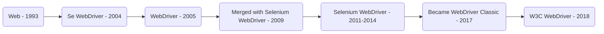
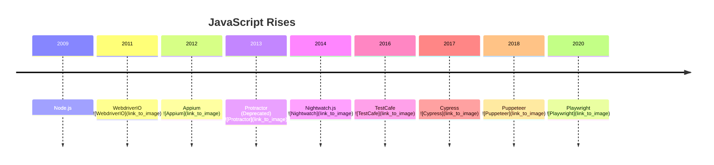
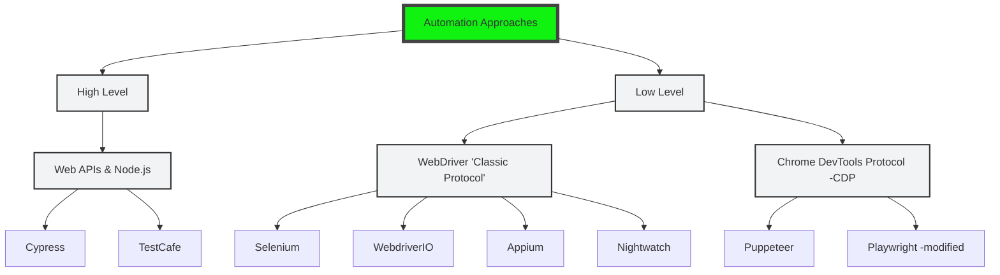
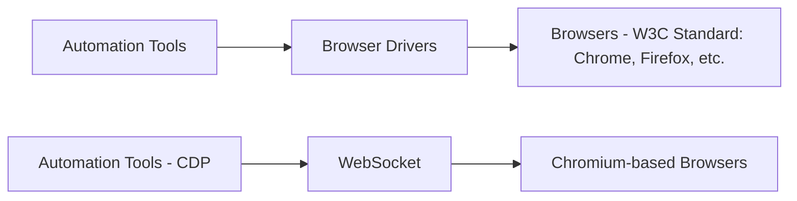

# Choosing the Right Framework: Exploring the Selenium Ecosystem for Testing

## Speaker: Diego Molina, Selenium Lead - OSPO Lead, Sauce Labs, Valencia

# Should You Choose Selenium?

### Yes
- 🟡 Cross-browser and cross-platform support
- 🟡 Based on a W3C standard
- 🟡 Local and remote execution
- 🟡 By the community, for the community

### No
- 🟡 Automatic waiting
- 🟡 Reporting
- 🟡 Assertions
- 🟡 Boilerplate code

# Selenium WebDriver


# WebDriver Ecosystem
## Tools and Libraries:
- **Nightwatch js**:
- **Appium/appium**: Cross-platform automation framework for all your apps built on iOS or Android.  
  
- **robotframework/SeleniumLibrary**: Web testing library for Robot Framework.  
  
- **Selenium Basic**:
- **SerenityJS**: Helps you write cleaner, more maintainable acceptance tests.  
  
- **Laravel Dusk**: Provides an expressive, easy-to-use browser automation and testing API.  
  
- **Panther**: A standalone browser testing library for PHP.
  
- **watir/watir**: Web application testing in Ruby.
  
- **selenide/selenide**: Concise UI tests for Java.
  
- **atata-framework/atata**: C#/.NET test automation framework.
  
- **iamalittletester/waiter2**: Wait for elements to load in Selenium tests.
  
- **titusfortner/selenium-logger**: Selenium logging in the browser.
  


## Implementations:
- **Selenium**: A browser automation framework and ecosystem.  
  
- **webdriverio/webdriverio**: Next-gen browser and mobile automation test framework for Node.js.  
  
- **php-webdriver/php-webdriver**: PHP client for Selenium WebDriver project.  
  

# JavaScript Rises


# Automation Approaches



# High-level - Cypress

### Node.js Process:
- Starts with Proxy
- Handles HTTP Requests and Responses

### Browser:
- Cypress tests with Application, manipulating DOM, Window, etc.

---

# High-level - TestCafe

### Browser Interaction:
- Opens page, sends and receives requests through the server

### TestCafe:
- Emulates requests and responses
- Injects autonomous scripts


# WebDriver 'Classic' Vs 'CDP'


# Low-Level Controls
1. Capturing console messages
2. Intercepting network requests
3. Simulating device mode
4. Simulating geolocation
5. And more!

# WebDriver BiDi Ecosystem
## Tools and Libraries:
- **Nightwatch js**:
- **Appium/appium**: Cross-platform automation framework for all your apps built on iOS or Android.  
  
- **robotframework/SeleniumLibrary**: Web testing library for Robot Framework.  
  
- **Selenium Basic**:
- **SerenityJS**: Helps you write cleaner, more maintainable acceptance tests.  
  
- **Laravel Dusk**: Provides an expressive, easy-to-use browser automation and testing API.  
  
- **Panther**: A standalone browser testing library for PHP.
  
- **watir/watir**: Web application testing in Ruby.
  
- **selenide/selenide**: Concise UI tests for Java.
  
- **atata-framework/atata**: C#/.NET test automation framework.
  
- **iamalittletester/waiter2**: Wait for elements to load in Selenium tests.
  
- **titusfortner/selenium-logger**: Selenium logging in the browser.
  


## Implementations:
- **Selenium**: A browser automation framework and ecosystem.  
  
- **webdriverio/webdriverio**: Next-gen browser and mobile automation test framework for Node.js.  
  
- **php-webdriver/php-webdriver**: PHP client for Selenium WebDriver project.  
  
- **puppeteer/puppeteer**:


# Features to Look For

- **Assertions on actions**
- **Initialization and cleanup**
- **Data modeling/mocking**
- **Configuration**
- **Wrappers and helpers**
- **API usage**
- **Future-ready features**
- **Local and cloud setups**
- **Speed and debugging features**
- **Cross-browser, simulators, emulators**
- **Built-in reporting**

---

# What Else Should I Consider?

- **Programming language**
- **Repository activity** (issues, stars, pull requests)
- **Support channels**
- **Documentation**
- **Proof of concept**
- **Governance**


# Java - Selenide

## Key Features:
- **Concise fluent API for tests**
- **Stable tests**
- **Powerful selectors**
- **Simple configuration**

## Sample Login Test:

```java
@Test
public void userCanLogin() {
    open("https://the-internet.herokuapp.com/login");
    $("#username").setValue("tomsmith");
    $("#password").setValue("SuperSecretPassword!").pressEnter();
    $("#flash").shouldHave(text("You logged into a secure area!"));
}
```

## Error Messages:
```bash
Element should be hidden {#gameWin}
Element: '</img>'
Screenshot: file:/.../hangman/build/reports/tests/1510751914648.0.png
Page source: file:/.../hangman/build/reports/tests/1510751914648.0.html
Timeout: 4 s.
```

# Tools Overview

### Watir
- **Watir**: An open-source Ruby library for automating tests. It provides a simple and efficient way to interact with web browsers through scripts.
  - **Features**:
    - Concise fluent API for tests
    - Stable tests with powerful selectors
    - Simple configuration
    - Supports extensive testing capabilities

### WebdriverIO
- **WebdriverIO**: A next-generation automation test framework for Node.js. It facilitates browser and mobile automation, integrating seamlessly into modern development workflows.
  - **Features**:
    - Supports synchronous and asynchronous execution
    - Extensible and customizable, fitting various testing needs
    - Rich ecosystem with numerous plugins

### Playwright
- **Playwright**: A JavaScript framework designed for reliable end-to-end testing of modern web applications. It provides robust testing features that support all major browsers.
  - **Features**:
    - Cross-browser and cross-platform testing
    - Handles both headless and non-headless modes
    - Powerful automation capabilities with a single API

### Atata
- **Atata**: A .NET/C# full-featured framework for automated web testing, designed to provide a comprehensive solution for enterprise environments.
  - **Features**:
    - Based on Selenium WebDriver
    - Supports Page Object patterns
    - Integrated with popular .NET testing tools and frameworks


