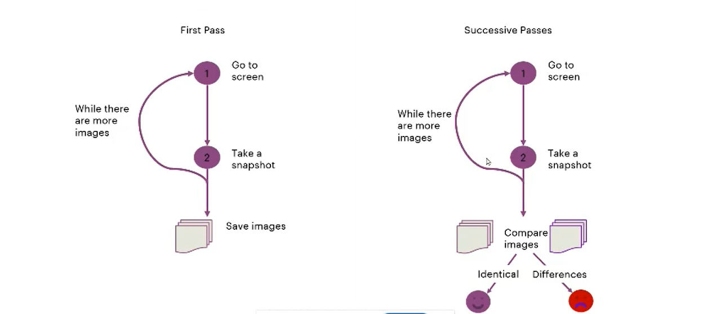

# Regress without Regret: Enhanced Visual Regression with Multi-Modal generative AI

## Speaker: Ahmed Kalifa, Software Quality Manager, Accenture
===========================================================
# Overview
1. The Evolution of Visual Testing
2. Rise of Generative Al
3. Impact of Visual Generative Al on Visual Testing
4. Conclusion and Learnings

# Testing Pyramid with Visual Regression Tests

1. **Unit Tests**: Testing small piece of code that can be isolated.
2. **Integration Tests**: Testing how different units of app work together.
3. **End-to-End-Tests**: Testcases are written as step-by-step instructions.
4. **Visual Regression Tests**: Validating that the chagnes we introduce to code don't have an unexpected impact on the generated Models(Image).

# Visual Tests Save the Day

# Playwright

# Snapshot or Pixel Comparison
* Like snapshot tests, but using screenshots
* Catch bugs in Ul appearance (what users see)
* Uses Pixel-by-pixel comparation
* Difficulty of implementation depends on project
## Benefits
* Prevent unintentional changes to UI
* Improve test coverage
## Often Problems
* False-Positive results (antialiasing, animations, dynamic values)
* Difficult to reivew test results

# Complexities and Challenges in Visual Testing of Web Front-End Design
* Evolution of Web Front-End Design
* More visual bugs
* DOM Comparison
* Limitations of DOM-Based Visual Testing
    - DOM Snapshots != Visually Identical Outputs
    - Identical DOM Structures can produce varying visual displays
    - Distinct DOM outputs can render the same visual appearance
    - Combining Pixel and DOM diffs can address some of these limiations (such as detecting DOM differences that appear the same visually), but they are still prone to false-positive results.

# Visual AI for Visual Testing
* Visual Al replicates the intricate processes of the human eye and brain to analyze and interpret data from computer screens.
* By simulating visual perception and cognitive functions, Visual Al enhances the ability of machines to understand, evaluate, and respond to visual information with high accuracy and efficiency.

# Visual AI for Visual Testing Tools
- LambdaTest
- Percy
- applitools
- Tricentis Tosca
- Kobiton
- Katalon Studio

# Rise of GenAI and LLMs
* Understand language data with human- level accuracy
* Solves dozens of different language tasks with a single model
* Be able to solve tasks even it hasn't been trained on
* Creates new content based on context understanding
* Does not require labelled data for initial training and retraining
* Can be fine-tuned with orders of magnitude less labelled data

1. Image Comparison - What are the visual differences between the two images?
2. Data Extraction from Forms - Extract all the data from the image and make sure that the output is in JSON format?
3. Form Field Validations (using GPT3.5 or using GPT4o) - What are the differences between the two forms?
4. Generating Manual Testcases from Wireframes - Generate a manual testcase of the Register Wireframe
5. Generating Defect Reports - Create a simple defect report for Visual Bugs

# AI Agents

# WebVoyager Agent

